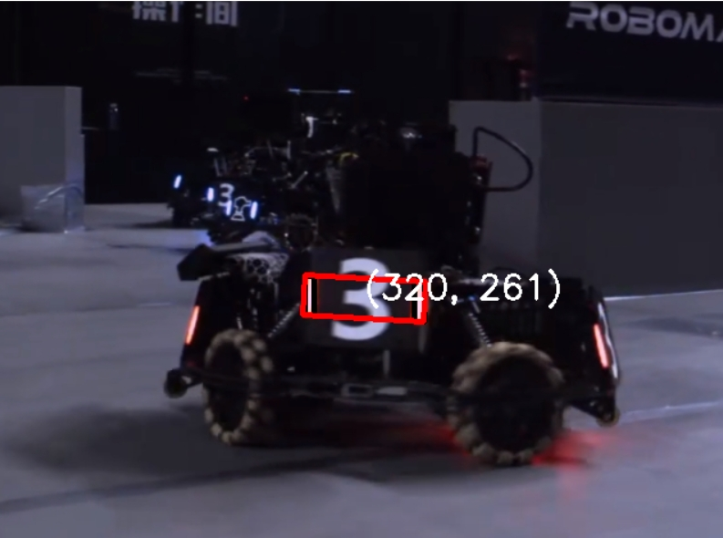

# RM_DETECTOR

---

## 使用传统视觉识别装甲板

---

## 运行代码的准备工作

### 1. 克隆代码库
使用 Git 克隆代码仓库：
```bash
git clone https://github.com/Rihoko520/rm_detector.git
```

### 2. 环境设置
- **安装 Python**: 确保已安装 Python 3.x。

### 3. 安装依赖库
运行以下命令安装所需库：
```bash
pip install opencv-python numpy scikit-image
```

### 4. 图像准备
- **准备待检测图像**: 确保图像格式为 JPG、PNG 等。
- **设置图像路径**: 修改代码中图像文件的路径：
```python
img = cv2.imread('path/to/your/image.jpg')
```

---

## 可改变的动态参数

### 1. 图像处理参数
- **`val`**: 
  - **类型**：`int`
  - **描述**：二值化阈值，默认值为 `33`。

- **`gamma`**: 
  - **类型**：`float`
  - **描述**：伽马校正值，默认值为 `7.5`。

### 2. 灯条索引和匹配参数
- **`angle_tol`**: 
  - **类型**：`int`
  - **描述**：允许的角度误差，默认值为 `15`。

- **`height_tol`**: 
  - **类型**：`int`
  - **描述**：允许的高度误差，默认值为 `100`。

- **`width_tol`**: 
  - **类型**：`int`
  - **描述**：允许的宽度误差，默认值为 `100`。

- **`cy_tol`**: 
  - **类型**：`int`
  - **描述**：中心 y 坐标之间的误差，默认值为 `100`。

### 3. 绘制数字颜色参数
- **`color`**: 
  - **类型**：`tuple`
  - **描述**：格式为 RGB，默认值为 `(0, 0, 0)`。

### 4. HSV 颜色范围参数

#### 红色 HSV 范围
- **`red_lower`**: 
  - **类型**：`np.array`
  - **描述**：红色的下限 HSV 值，默认值为 `np.array([0, 43, 46])`。

- **`red_upper`**: 
  - **类型**：`np.array`
  - **描述**：红色的上限 HSV 值，默认值为 `np.array([10, 255, 255])`。

- **`red_upper_hue`**: 
  - **类型**：`np.array`
  - **描述**：红色（上半部分）的下限 HSV 值，默认值为 `np.array([160, 100, 100])`。

- **`red_upper_hue_max`**: 
  - **类型**：`np.array`
  - **描述**：红色（上半部分）的上限 HSV 值，默认值为 `np.array([180, 255, 255])`。

#### 蓝色 HSV 范围
- **`blue_lower`**: 
  - **类型**：`np.array`
  - **描述**：蓝色的下限 HSV 值，默认值为 `np.array([100, 43, 46])`。

- **`blue_upper`**: 
  - **类型**：`np.array`
  - **描述**：蓝色的上限 HSV 值，默认值为 `np.array([124, 255, 255])`。

- **`blue_upper_hue`**: 
  - **类型**：`np.array`
  - **描述**：蓝色（上半部分）的下限 HSV 值，默认值为 `np.array([24, 25, 255])`。

- **`blue_upper_hue_max`**: 
  - **类型**：`np.array`
  - **描述**：蓝色（上半部分）的上限 HSV 值，默认值为 `np.array([150, 65, 255])`。

---

## <Findhsv.py> 功能介绍

`Findhsv.py` 通过 **HSV**（色相、饱和度、明度）阈值过滤来识别特定颜色，主要用于调整识别灯条时 **红色** 和 **绿色** 掩膜的 **HSV** 数值。

### 使用说明
- 修改 `mode` 变量以选择处理模式（图像或视频流）。
- 若选择图像模式，确保图片路径正确。
- 若选择视频流模式，确保视频源可用并正确设置 URL。
- 运行脚本后，通过滑动条调整 HSV 值以实现颜色过滤，并实时查看结果。

---

## <adjust.py> 功能介绍

`adjust.py` 通过调整 **伽马值** 和 **阈值** 来实现图像的 **二值化** 处理，用于调整处理图像的动态参数。

### 使用说明
- 修改 `mode` 变量以选择处理模式（图像或视频流）。
- 确保在图像模式下文件路径正确，或在视频流模式下确保视频源可用。
- 运行脚本后，通过滑动条调整伽马值和阈值，以查看不同处理效果的实时结果。

---

## <detector.py> 函数功能描述

### 1. `adjust_rotated_rect(rect)`
- **功能**：调整旋转矩形的宽高和角度，使宽始终小于高。返回调整后的中心坐标、宽高和角度。

### 2. `is_close(rect1, rect2, angle_tol, height_tol, width_tol, cy_tol)`
- **功能**：检查两个旋转矩形是否足够接近，比较角度、高度、宽度和中心 y 坐标的差异。

### 3. `put_text(img, color, rect)`
- **功能**：在图像上绘制旋转矩形的中心坐标文本。

### 4. `do_polygons_intersect(a, b)`
- **功能**：使用分离轴定理检查两个多边形是否相交，返回布尔值。

### 5. `project_polygon(polygon, axis)`
- **功能**：将多边形投影到给定的轴上，返回投影的最小值和最大值。

### 6. `img_processed(img, val, gamma)`
- **功能**：处理输入图像，返回二值图像、调整大小的图像和经过伽马校正的浮点图像。

### 7. `find_light(color, img_binary, img)`
- **功能**：查找图像中的光源并返回旋转矩形，使用轮廓检测和相交检测过滤轮廓。

### 8. `armortype(img_blur, rotated_rect)`
- **功能**：判断装甲的类型并返回相应的类 ID，通过颜色检测计算红色和蓝色像素的比例。

### 9. `track_armor(img, img_blur, rotated_rects, angle_tol=15, height_tol=100, width_tol=100, cy_tol=100)`
- **功能**：跟踪装甲并返回装甲字典，将相近的旋转矩形分组并合并，判断装甲类型。

### 10. `destroy()`
- **功能**：销毁所有 OpenCV 窗口，释放资源。

---

## 装甲板识别流程

### 1. 图像处理
- **`img_processed(img, val, gamma)`**:
  - **调整图像大小**: 将图像调整为 `(640, 480)`。
  - **伽马校正**: 应用伽马校正以增强图像亮度。
  - **灰度转换**: 将图像转换为灰度图进行二值化处理。
  - **二值化**: 使用阈值 `val` 生成二值图像，便于后续的轮廓检测。

### 2. 查找光源
- **`find_light(color, img_binary, img)`**:
  - **轮廓检测**: 使用 `cv2.findContours` 查找图像中的轮廓，并返回旋转矩形。
  - **过滤小面积轮廓**: 过滤小面积的轮廓，确保只处理较大的轮廓。
  - **轮廓相交检测**: 调用 `do_polygons_intersect(a, b)` 检查轮廓之间是否相交，避免重复检测。

### 3. 跟踪装甲
- **`track_armor(img, img_blur, rotated_rects, angle_tol=15, height_tol=100, width_tol=100, cy_tol=100)`**:
  - **分组旋转矩形**: 将相近的旋转矩形分组，以便合并处理。
  - **合并相邻矩形**: 合并相邻的旋转矩形，过滤掉面积过小的矩形。
  - **判断装甲类型**: 调用 `armortype(img_blur, rotated_rect)` 函数判断装甲类型，返回相应的类 ID。
  - **生成装甲字典**: 包含每个装甲的类 ID、高度和中心坐标，并在图像上绘制检测结果。

 
### 4. 返回结果返回包含检测到的装甲信息的字典：
```
bash{'320': {'class_id': 7, 'height': 106, 'center': [320, 261]}}
```
 


